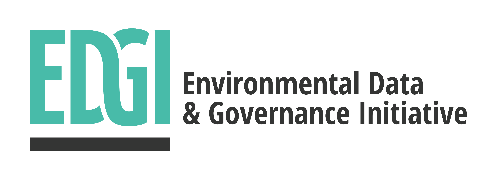
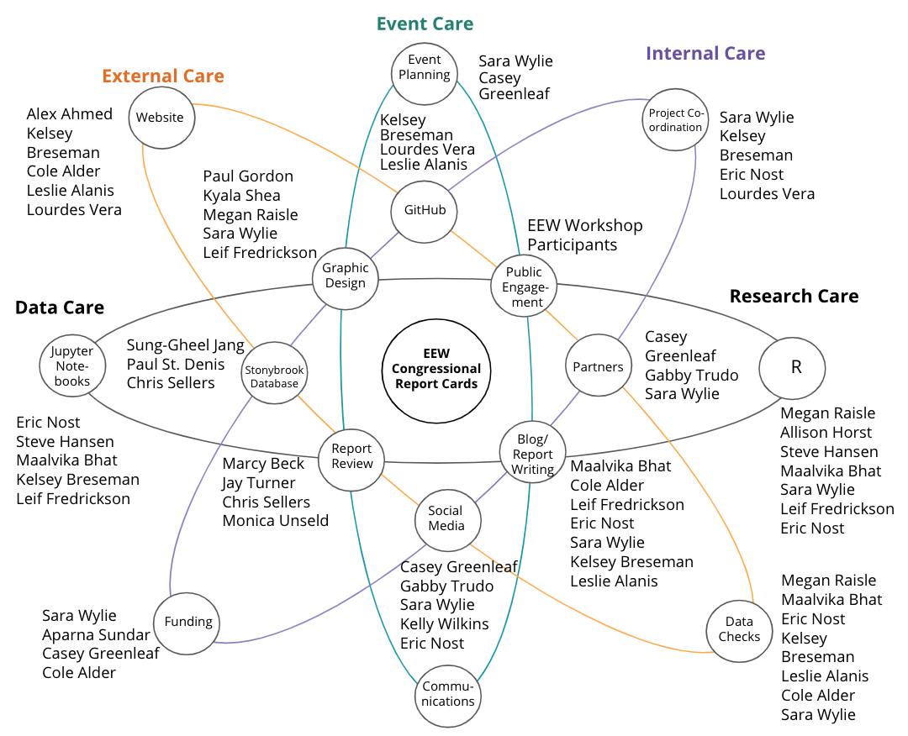

<!--This is the main content file to edit for this page. It is embedded in src/pages/about.js. The page title comes from the .json in this same folder.-->

<!--The text at the top of this page is pulled from `eew-desc.md` in this folder-->

## Our Goals
* Draw large-scale public attention to the lack of environmental enforcement.
* Work with partner organizations, especially marginalized communities, to build data efficacy through mutually beneficial relationships
* Inform EPA visions of alternative forms of public engagement
* Prototype community-oriented structures for environmental data, i.e. by congressional district, watershed, and health risks for a community
* Bring attention to the relationship between environmental enforcement, environmental racism, and other interlocking forms of oppression (particularly white supremacy, capitalism, settler-colonialism, heteropatriarchy, etc.)

## The Environmental Data and Governance Initiative
EDGI is an international network of over 175 members from more than 80 different academic institutions and non-profits, comprised primarily of grassroots volunteer efforts. Since 2016, EDGI has served as a preeminent watchdog group for federal environmental data, generating international efforts to duplicate and monitor repositories of public data vital to environmental health research and knowledge.

EDGI’s work has been widely acknowledged, leading to EDGI members testifying before Congress on declines in EPA enforcement, and hundreds of mentions in leading national and international media such as *The New York Times*, *The Washington Post*, *Vice News*, and *CNN*. For more about our work, read our <a href="https://envirodatagov.org/publication/edgi-annual-report-2020/" target=_blank rel=noopener >2020 Annual Report</a> and <a href="https://envirodatagov.org/publication/edgi-annual-report-2019/" target=_blank rel=noopener >2019 Annual Report</a>. 

## Environmental Data Justice
A lot of the work in EEW stems from EDGI’s work around “Environmental Data Justice,” or EDJ. EDJ promotes the production and use of environmental data in ways that challenge structures of oppression like fascism, racism, heteropatriarchy, and classism. We believe that data should serve communities and not just corporate polluters. We also believe that communities should have more resources for collecting and analyzing environmental data while retaining the power to decide what they do with it. You can read more about EDJ and find some related readings in the <a href="https://drive.google.com/drive/folders/1F0N3NOxcZBmlDW57IyAnSTQ8XZtESEn1" target=_blank rel=noopener >EDJ Syllabus here</a>.

## EEW’s Domains of Care 
EEW is organized around domains of care, with each collaborator on the project supporting one or more dimensions that we collectively agree is vital to working toward EDGI’s <a href="https://envirodatagov.org/about/mission-vision-values/#:~:text=EDGI%20fosters%20the%20stewardship%20and,enable%20government%20and%20industry%20accountability." target=_blank rel=noopener >mission, vision, and values</a>. In particular, we aim to build a culture of collaboration that enacts our values as well as processes that help “realize a world that creates and maintains healthy, just, bountiful, and beautiful environs in which people thrive.” 

**Internal Care**: Respectful, collaborative relations between us are core to our success. The work of internal care involves ensuring a shared, collective workflow where people are aware of each other and in which everyone has a role, feels valued, can share their concerns, and which is adaptable enough to adjust based on feedback. We also work to keep the rest of EDGI informed about EEW and balance EEW with the needs and priorities of EDGI’s other projects.

**External Care**: EEW's overall goal is to express collective care for human and non-human environmental health. EDGI is collectively responsible for this work, so communication around it needs to be coordinated, consensus-based, fair, accurate, and responsible. We also seek to form mutually supportive collaborations with partner organizations.

**Data Care**: Data is core to our organizational ethics around Data Justice. Data Care involves ensuring that data are traceable, cited, accurate, and reported responsibly.

**Research Care**: There is no such thing as “raw data.” Research care involves contextualizing our data with further research, supporting our arguments with citable evidence and combining different forms of knowledge to present useful insights. Research care involves reviewing and fact-checking our work and revising based on feedback.

**Event Care**: EEW Events bring people together to hear each other and work together; they are crucial social elements of our work. Participants need to be welcomed, supported to collaborate effectively, and work should be enjoyable and valuable. Our event care work should build participants’ sense of efficacy and ensure mutually respectful conduct.

Rather than presenting a hierarchical representation of contributions, below we diagram our collective authorship in accordance with <a href="https://docs.google.com/document/d/1SZeIVuJ4kjosq9GXTx8AauEF4RJYOftYyuPsj68kVck/edit#heading=h.k0ozbm3wj762" target=_blank rel=noopener >EDGI’s authorship protocol</a>: 

## Core Contributors

## Collaborators
- <a href="https://www.stonybrook.edu/commcms/gss/" target=_blank rel=noopener >Geospatial Center at Stony Brook University</a>
- <a href="http://apps.tlt.stonybrook.edu/" target=_blank rel=noopener >Teaching Learning Lab at Stony Brook University</a>
- <a href="http://www.facebook.com/SunriseBoston/" target=_blank rel=noopener >Sunrise Movement – Boston Hub</a>
- <a href="https://www.ucsusa.org//" target=_blank rel=noopener >Union of Concerned Scientists</a>

## Funders
- <a href="https://www.ddcf.org/" target=_blank rel=noopener >The Doris Duke Charitable Foundation</a>
- <a href="https://www.packard.org/" target=_blank rel=noopener >The David and Lucile Packard Foundation</a>
- <a href="https://web.northeastern.edu/nulab/" target=_blank rel=noopener >Northeastern University Lab for Texts, Maps, and Networks</a>
