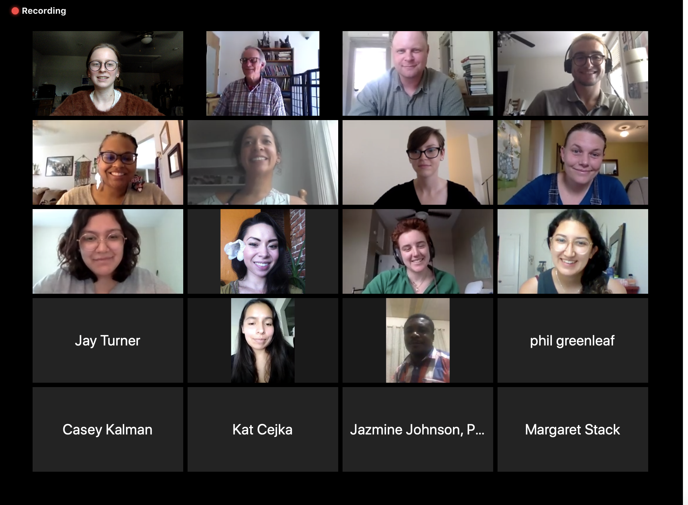

<!--This is the main content file to edit for this page. It is embedded in src/pages/events.js. The page title comes from the .json in this same folder.-->

<!--The text at the top of this page is pulled from `events-snippet.md` in this folder-->
# EEW Events

EDGI's EEW events engage members of the public in the process of report-making, from delving into the data science and running jupyter notebooks to sharing stories about their home areas. Over the summer, we co-hosted workshops with the [Sunrise Movement Boston Hub](https://www.sunrisemovement.org/hubs/), as well as a four-part public workshop series dedicated to the completion of EEW Congressional Report Cards [link to reports page](https://edgi-govdata-archiving.github.io/EEW-Website/reports "Link to Reports Page") for two key committees. In commitment to the principles of EDJ, all of our code and data is available on [EDGI’s GitHub site](https://github.com/edgi-govdata-archiving "Link to EDGI's Github"), an open-source coding platform. 

A screenshot of participants from one of the EEW Events.

## Recordings of past events:
- [Sunrise Boston workshop 06/18/2020](https://www.youtube.com/watch?v=rCs35rmDo9c&list=PLtsP3g9LafVv78TIa42xr591-4CfKMYQO&index=46&t=1678s)
- [EEW Public Hours workshop 1 (8/20/2020)](https://www.youtube.com/watch?v=Gp1aDeXMays&list=PLtsP3g9LafVv78TIa42xr591-4CfKMYQO&index=28)
- [EEW Public Hours workshop 2 (8/27/2020)](https://www.youtube.com/watch?v=rZrxGRBdJVA&list=PLtsP3g9LafVv78TIa42xr591-4CfKMYQO&index=22&t=4s)
- [EEW Public Hours workshop 3 (9/3/2020)]()
- [EEW Public Hours workshop 4 (9/10/2020)](https://www.youtube.com/watch?v=dUV3NweSWTs&list=PLtsP3g9LafVv78TIa42xr591-4CfKMYQO&index=18)

## You Can EEW Too
Importantly, these workshops are not meant to center EDGI or the EEW team. Rather, we hope that every workshop will be co-hosted by one or more partner organizations: community groups, national environmental watchdogs, research hubs, and everything in between. We are here to help you answer pressing questions and create materials and networks that support your advocacy and organizing efforts.

EEW workshops begin with collective report-making through the Jupyter Notebooks, followed by breakout sessions into different tracks (Storytelling, Research and Contextualization, Data Visualization, and Data Science) based on participants’ own skills and interests. The outcomes of the various tracks will then be compiled into a single report that is informative, visually interesting, and oriented toward community action. We strongly encourage and can help facilitate EEW partners in developing other creative demonstrations and outcomes from these workshops.

## EEW Event Tracks

## Data Tools and Workshop Structure

ECHO includes compliance data on air, water, and hazardous waste laws for all facilities permitted to emit, store, and use hazardous materials along with data on inspections and enforcement actions taken by EPA and state agencies. It is the first database to publicly share federal environmental enforcement data. However, the website itself can be hard for non-specialists to use and understand. To increase ECHO’s public accessibility, the EEW team is developing a series of Jupyter Notebooks – collaborative, open-source data analysis tools – so people can use this information from ECHO to make customizable reports on pollution from facilities in areas of interest.

These reports can include information about EPA inspections, whether facilities are complying with federal regulations, and if EPA has responded to violations with enforcement actions. We’ve already written the code to generate reports based on the data—during the workshops, participants simply run the notebook to generate the data for their area of interest. No coding or data science experience is needed!

We’ve already developed Notebooks that generate several different types of report metrics. One gathers data on facility inspections, violations, and enforcement actions for three different regulatory statutes ([CAA](https://www.epa.gov/laws-regulations/summary-clean-air-act), [CWA](https://www.epa.gov/laws-regulations/summary-clean-water-act), [RCRA](https://www.epa.gov/laws-regulations/summary-resource-conservation-and-recovery-act)) at the zip-code, congressional district, and county level. Another allows users to investigate a specific facility of concern across the same three regulatory statutes. A specialized notebook was developed to analyze declining enforcement during the COVID-19 crisis, in order to supplement [EDGI’s COVID Enforcement Report](https://envirodatagov.org/more-permission-to-pollute-the-decline-of-epa-enforcement-and-industry-compliance-during-covid/). We can work with partner organizations to specialize notebooks for questions they want answered. We want to make environmental compliance data more accessible and useful through our Jupyter Notebooks and supplementing the numbers with community stories, compelling data visualizations, and contextual research.
 

<big>Together, we can use publicly available data to hold our government and industry accountable.</big>

Sign up below to hear about upcoming events:

